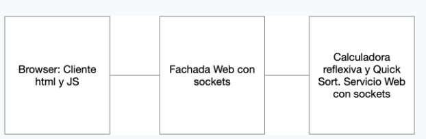

# AREP_PARCIAL

Este es un intento de la creacion de de la siguiente arquitectura.

# DETAIL

Se intento abri la conexion en los puerto. Se crearon los controler y un servicio. Tambien se crearon las respuesta de OK de JSON para el servicio REST de la calculadora.
